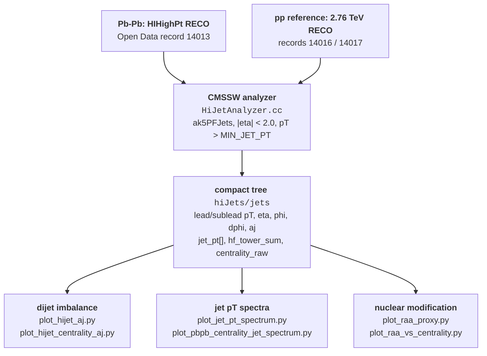

# Jet quenching with CMS Open Data: Pb-Pb and pp at 2.76 TeV

When a quark or gluon is scattered hard inside a heavy-ion collision, it has to
traverse the hot, dense medium created around it. It loses energy on the way,
so the jet that emerges carries less momentum than it started with. Two
signatures follow: jets are **suppressed** relative to a proton-proton baseline
(the ratio $R_{AA}$), and a back-to-back **dijet pair comes out lopsided**,
because the two jets travel different path lengths through the medium (the
imbalance $A_J$).

This repository builds the analysis chain for both, from CMS 2011 open data:
inspect the reconstructed collections, extract a compact tree with a CMSSW
analyzer, then select jets and make distributions in Python.

> **Status: the workflow runs end to end on small samples. It is not a
> corrected measurement, and the $R_{AA}$-like ratios here are explicitly
> labelled proxies.** The largest single gap is that the Pb-Pb jets are not
> background-subtracted -- see [Caveats](#caveats). Read that section before
> using any number from this repository.

<!-- figures/ is not yet populated. Once a run produces results/*.png, copy the
     representative plots here and uncomment. See "Figures" below.
<p align="center">
  
</p>
-->

---

## Status at a glance

| Stage | Implementation | Verified to |
|---|---|---|
| Inspect reconstructed data | CMSSW event-content helpers, ROOT inspection scripts | Collections listed from a real HIHighPt file |
| Extract jet variables | `HiJetAnalyzer.cc`, Pb-Pb and pp configurations | Runs on remote RECO; first jet summary recorded |
| Dijet kinematics | Leading/subleading $p_T$, $\Delta\phi$, $A_J$ | Branches filled; **no dijet selection applied yet** |
| Event-activity grouping | HF tower sum as a centrality proxy | Quartile split implemented; **not calibrated centrality** |
| Jet $p_T$ spectra | Inclusive and per-event Pb-Pb / pp comparison | Plots produced from small runs |
| Nuclear modification | $R_{AA}$-proxy ratio scripts | Ratio computed; **normalization and subtraction missing** |

Generated ROOT files and plots are gitignored -- reproduce them locally with
the steps below.

---

## Quick start

**1. Python side** (plotting only; this does not give you CMSSW):

```powershell
python -m venv .venv
.\.venv\Scripts\python.exe -m pip install -r requirements.txt
```

**2. CMS runtime.** Follow [`docs/CMS_ENVIRONMENT.md`](docs/CMS_ENVIRONMENT.md)
for WSL2, Docker, the CMS image and runtime checks. Mount the repository at
`/work`.

**3. Extract a small Pb-Pb sample**, inside the container:

```bash
cd /work
bash cms/install_hijet_analyzer.sh
bash cms/run_hijet_analyzer.sh 10 hihighpt_jets.root
```

Up to 10 events from the configured remote input, written to
`results/hihighpt_jets.root`. This is a connectivity and chain check, not a
statistically meaningful sample; remote RECO access can be slow.

**4. First distribution**, back on the host:

```powershell
.\.venv\Scripts\python.exe src\plot_hijet_aj.py
```

Output at `results/hihighpt_aj_hist.png`. A very small sample may leave the
histogram empty.

For pp processing, centrality-proxy selections, spectra and ratios, continue
with [`docs/RAA_WORKFLOW.md`](docs/RAA_WORKFLOW.md).

---

## How it fits together



Both collision systems go through the **same** analyzer and the same tree
format; only the input files and the `jets` InputTag process differ. That is
what makes a Pb-Pb / pp ratio meaningful at all -- and also why any bias in the
analyzer applies to both sides equally.

---

<details>
<summary><b>0. Theory background: what quenching is and what these observables measure</b></summary>

Conventions: natural units, $p_T$ = momentum transverse to the beam,
$\eta = -\ln\tan(\theta/2)$, $\sqrt{s_{NN}}$ = collision energy per
nucleon-nucleon pair.

### 0.1 Why jets are the probe

A hard parton scattering happens in the first $\sim 0.1$ fm/c of the
collision, long before the medium has formed. The parton is therefore *made
before* the thing you want to study, and it then has to cross it. Nothing has
to be assumed about how it was produced: the production rate is fixed by
perturbative QCD and measured independently in pp. Whatever is left over when
you compare Pb-Pb to pp is attributable to the medium.

That is the whole logic, and it is why the pp reference is not optional. **A
Pb-Pb measurement alone says nothing.**

### 0.2 $R_{AA}$: counting jets that should be there

If a nucleus-nucleus collision were just many independent nucleon-nucleon
collisions, hard processes would simply scale with the number of those binary
collisions, $N_{\mathrm{coll}}$. The nuclear modification factor asks whether
they do:

$$R_{AA}(p_T) = \frac{1}{\langle T_{AA}\rangle}\cdot\frac{d^2N_{AA}/dp_Td\eta}{d^2\sigma_{pp}/dp_Td\eta}$$

$\langle T_{AA}\rangle = \langle N_{\mathrm{coll}}\rangle/\sigma_{NN}^{\mathrm{inel}}$
is the nuclear overlap function, obtained from a Glauber model for the
centrality class in question. $R_{AA} = 1$ means no medium effect;
$R_{AA} < 1$ means suppression. Measured jet $R_{AA}$ at the LHC sits around
$0.5$ at high $p_T$ in central collisions.

Three things have to be right for that number to mean anything, and they are
exactly what a proxy ratio skips:

1. **$\langle T_{AA}\rangle$ for the actual centrality class.** Without it the
   ratio is off by a factor of order $N_{\mathrm{coll}}$, which runs from
   $\sim 1600$ (central) to $\sim 10$ (peripheral) for Pb-Pb.
2. **A per-cross-section pp denominator**, not a per-event yield, unless the
   Pb-Pb side is also per-event *and* the normalization is handled
   consistently.
3. **The same jet definition and the same corrections on both sides.**

### 0.3 $A_J$: watching one jet lose more than the other

A hard scattering produces two partons back-to-back in the transverse plane
with balanced $p_T$. If the pair is produced off-centre in the fireball, one
parton has a short path out and the other a long one, so they lose different
amounts of energy. The surviving imbalance is

$$A_J = \frac{p_{T,1} - p_{T,2}}{p_{T,1} + p_{T,2}}$$

with $p_{T,1}$ the leading and $p_{T,2}$ the subleading jet. $A_J$ shifts to
larger values in central Pb-Pb relative to pp -- the observation that made the
2011 CMS and ATLAS dijet-asymmetry papers.

$A_J$ is only interpretable for a genuine back-to-back **dijet**. The standard
selection requires all three of:

$$p_{T,1} > 120\ \mathrm{GeV}, \qquad p_{T,2} > 50\ \mathrm{GeV}, \qquad \Delta\phi_{12} > \frac{2\pi}{3}$$

Without the $\Delta\phi$ requirement the "pair" may be two unrelated jets, and
without the $p_T$ thresholds the imbalance is dominated by resolution rather
than energy loss. **The scripts here currently apply none of these** (see
Caveats); the branches are written, the cuts are not.

### 0.4 Centrality, and why a proxy is not one

How much medium a jet crosses depends on how head-on the collision was.
Centrality is defined by ranking events by an activity measure -- CMS uses the
sum of transverse energy in the forward hadron calorimeters -- and cutting that
distribution into percentiles, then mapping each percentile onto
$\langle N_{\mathrm{part}}\rangle$ and $\langle N_{\mathrm{coll}}\rangle$
through a Glauber model fit.

Two steps, and this repository does only the first. Ranking events by
`hf_tower_sum` and splitting at quartiles gives *relative* ordering within
whatever sample you happened to extract. It does **not** give you the 0-10%
class of all Pb-Pb collisions, and it gives you no $N_{\mathrm{coll}}$ at all.
Labelling those groups with conventional percentages would be a claim the
analysis has not earned.

### 0.5 The underlying event: the problem specific to Pb-Pb

A central Pb-Pb collision deposits an enormous amount of soft, uncorrelated
energy everywhere in the detector. Any jet cone drawn in that event collects
its share, whether or not a jet is there.

The scale is easy to estimate. ALICE measured
$\langle dE_T/d\eta\rangle = 1737 \pm 6\,\mathrm{(stat)} \pm 97\,\mathrm{(sys)}$
GeV at midrapidity for 0-5% central Pb-Pb at 2.76 TeV
([arXiv:1603.04775](https://arxiv.org/abs/1603.04775)). Spread over $2\pi$ in
azimuth that is a density

$$\rho = \frac{1}{2\pi}\frac{dE_T}{d\eta} \approx 277\ \mathrm{GeV\ per\ unit}\ \eta\text{-}\phi\ \mathrm{area}$$

and an anti-$k_T$ jet of radius $R$ covers an area $\approx \pi R^2$:

| $R$ | jet area | $\langle$UE in the cone$\rangle$ |
|---|---|---|
| 0.3 | 0.28 | $\approx 78$ GeV |
| 0.5 | 0.79 | $\approx 217$ GeV |
| 0.7 | 1.54 | $\approx 426$ GeV |

This is an order-of-magnitude estimate, not a substitute for the real
subtraction -- but the order of magnitude is the point. Heavy-ion jet
reconstruction therefore *always* subtracts this background before a jet $p_T$
means anything, and the residual event-by-event fluctuation of the background
is itself a leading systematic.

</details>

<details>
<summary><b>1. The extraction step</b> (<code>cms/</code>)</summary>

`HiJetAnalyzer.cc` is a minimal `EDAnalyzer`: it reads a
`vector<reco::PFJet>`, applies two cuts, finds the two highest-$p_T$ jets, and
writes one row per event.

| Parameter | Pb-Pb | pp |
|---|---|---|
| `jets` | `ak5PFJets::ppRECO` | `ak5PFJets::RECO` |
| `centrality` | `hiCentrality::RECO` | `hiCentrality::RECO` |
| `maxAbsEta` | 2.0 | 2.0 |
| `minJetPt` | `MIN_JET_PT`, default 30 GeV | same |

`ak5` is anti-$k_T$ with $R = 0.5$, particle-flow inputs. The recorded event
content of the HIHighPt file lists only pp-style collections
(`ak5CaloJets`, `ak5PFJets`, `ak7*`, all from the `ppRECO` process) -- there
are no `akPu*` or `akVs*` background-subtracted collections in it. That is the
origin of the subtraction gap in Caveats: it is a property of the input, not a
wrong choice of tag.

Output tree `hiJets/jets`, one entry per event:

| Branch | Meaning |
|---|---|
| `run`, `lumi`, `event` | event identification |
| `nJet` | jets passing the two cuts |
| `lead_pt/eta/phi`, `sublead_pt/eta/phi` | the two highest-$p_T$ jets |
| `dphi` | $\lvert \phi_1 - \phi_2 \rvert$ folded into $[0,\pi]$ |
| `aj` | $(p_{T,1}-p_{T,2})/(p_{T,1}+p_{T,2})$, filled only when both jets exist |
| `jet_pt[]`, `jet_eta[]`, `jet_phi[]` | all selected jets |
| `hf_tower_sum`, `centrality_raw` | forward activity, for the centrality proxy |

Events with fewer than two selected jets get `aj` left at its sentinel value,
which is why every downstream script starts with `aj >= 0`.

</details>

<details>
<summary><b>2. The analysis step</b> (<code>src/</code>)</summary>

All scripts read the compact tree with `uproot` and write into `results/`.

| Script | Produces |
|---|---|
| `inspect_root.py`, `inspect_hijet_events.py` | ROOT structure and per-event dumps |
| `plot_hijet_aj.py` | $A_J$ histogram |
| `plot_hijet_centrality_aj.py` | $A_J$ split at the upper/lower quartile of `hf_tower_sum` |
| `plot_jet_pt_spectrum.py` | inclusive selected-jet $p_T$ spectrum |
| `plot_pbpb_centrality_jet_spectrum.py` | Pb-Pb spectra, central-like vs peripheral-like |
| `plot_raa_proxy.py` | per-event yield ratio Pb-Pb / pp |
| `plot_raa_vs_centrality.py` | that ratio integrated, versus the activity proxy |
| `summarize_hijet_sample.py`, `summarize_jet_outputs.py` | sample and output summaries |

The ratio scripts divide **per-event yields**: each spectrum is a histogram of
selected jets divided by the number of events in that sample. That removes the
difference in sample size but not the difference in $N_{\mathrm{coll}}$, which
is the physics normalization $R_{AA}$ requires (section 0.2).

</details>

<details>
<summary><b>3. Figures</b></summary>

`figures/` exists so that representative plots can be committed and shown at
the top of this README. It is currently empty: `results/` is gitignored, and
regenerating a plot requires the CMS runtime plus remote open-data access, so
nothing is reproducible from a fresh clone alone.

To populate it, after a run that produced plots you are willing to stand
behind:

```bash
cp results/hihighpt_aj_hist.png             figures/
cp results/pbpb_centrality_jet_spectrum.png figures/
cp results/raa_proxy_spectra_per_event.png  figures/
```

then uncomment the `<p align="center">` block near the top. Commit a figure
only with its sample size and cuts stated in the caption -- a plot from a
10-event check should say so.

</details>

---

## Data and software

| Input | Source |
|---|---|
| Pb-Pb HIHighPt, 2011, 2.76 TeV | [CERN Open Data record 14013](https://opendata.cern.ch/record/14013) |
| pp reference candidates, 2011, 2.76 TeV | [record 14016](https://opendata.cern.ch/record/14016), [record 14017](https://opendata.cern.ch/record/14017) |
| pp validated luminosity sections | [record 14208](https://opendata.cern.ch/record/14208) |

Extraction uses **CMSSW 4.4.7** in a CMS container. Plotting uses `uproot`,
`awkward`, NumPy, pandas, matplotlib. Installing `requirements.txt` does not
provide the CMSSW runtime.

## Repository layout

```
cms/HiJetAnalysis/JetAnalyzer/plugins/   C++ analyzer + BuildFile
cms/run_*.sh, cms/run_*_cfg.py           runtime wrappers, Pb-Pb / pp settings
src/                                     inspection, plotting, summary scripts
docs/CMS_ENVIRONMENT.md                  WSL2 / Docker / CMSSW setup
docs/RAA_WORKFLOW.md                     analysis steps and recorded results
docs/ROOT.md                             ROOT basics
notebooks/                               starter notebooks
data/, results/                          inputs and outputs (gitignored)
figures/                                 committed plots for this README
```

## Caveats

Ordered by how much they affect a number you might quote.

- **Pb-Pb jets are not background-subtracted.** The available collections are
  pp-style `ak5PFJets`; the underlying event inside an $R = 0.5$ cone in
  central Pb-Pb is of order $200$ GeV (section 0.5), against a default jet
  threshold of 30 GeV. Every Pb-Pb jet $p_T$ in this repository is therefore
  inflated by an amount that **grows with centrality** -- which is the same
  direction a quenching signal would appear in. Until this is subtracted, a
  centrality-dependent ratio cannot be read as energy loss, and low-$p_T$ bins
  are essentially background.
- **No dijet selection.** $A_J$ is filled for any event with two selected
  jets. The standard $p_{T,1} > 120$, $p_{T,2} > 50$ GeV,
  $\Delta\phi_{12} > 2\pi/3$ requirements (section 0.3) are not applied, even
  though `dphi`, `lead_pt` and `sublead_pt` are read into the plotting
  scripts. The current $A_J$ distribution therefore mixes real dijets with
  unrelated jet pairs.
- **`hf_tower_sum` groups are relative, not calibrated centrality.** Quartiles
  of the extracted sample are not percentiles of all Pb-Pb collisions, and
  they carry no $N_{\mathrm{coll}}$. Conventional percentage labels on such
  plots are not a calibration.
- **The ratio is not $R_{AA}$.** No $\langle T_{AA}\rangle$, no cross-section
  normalization, no trigger or luminosity treatment, no jet energy
  corrections, no unfolding, no systematic uncertainties.
- **Reconstructed jets, not raw detector signals.** This repository reads
  existing jet collections; it does not reconstruct tracks or jets.
- **Recorded results are small-run chain checks**, demonstrating that the
  workflow executes, not that any physics result is validated.

## Next steps

1. **Subtract the underlying event** -- either by locating a dataset that
   provides `akPu*`/`akVs*` collections, or by implementing a
   constituent-level or area-based subtraction on `ak5PFJets`. Nothing
   downstream is quantitative until this is done.
2. **Apply the dijet selection** to $A_J$: the three cuts in section 0.3. Cheap
   to do, and the branches are already there.
3. Fix a reproducible sample list and matched Pb-Pb / pp selections; document
   trigger treatment, luminosity selection and jet-collection compatibility.
4. Replace the HF-activity proxy with a Glauber-based centrality calibration
   providing $\langle N_{\mathrm{coll}}\rangle$ and $\langle T_{AA}\rangle$.
5. Add jet energy corrections, unfolding, and systematic uncertainties.
6. Publish a compact set of representative figures with sample sizes and cuts
   stated.

See [`CHANGELOG.md`](CHANGELOG.md) for the recorded progression.
